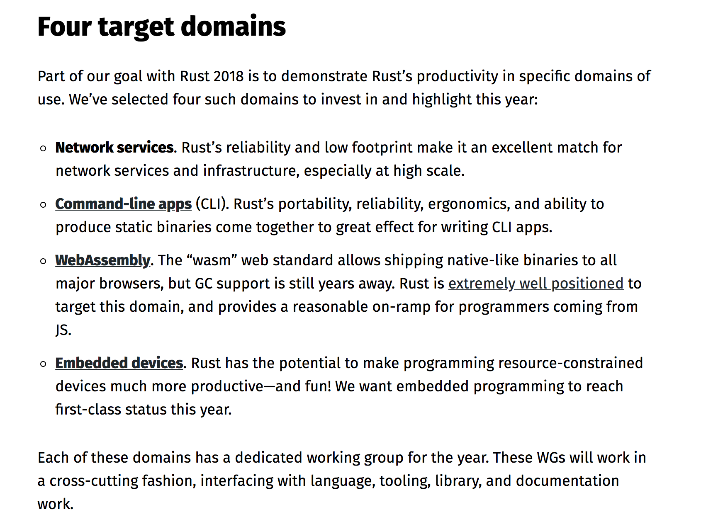

# Rust-docs
https://www.rust-lang.org/

참고하는 영상 자료: https://www.youtube.com/watch?v=zF34dRivLOw&t=649s&ab_channel=TraversyMedia

이거 진짜 머냐.... 이게 진짜 좋은게 맞나...? 해괴망측하게 생겼다. 

## Why Rust?
- performance
  - 빠르고, 메모리 효율적이다. 가비지 콜렉터나 런타임 없이도 성능이 아주 중요한 서비스를 운영할 수 있고, 임베디드 기기 위에서도 동작할 수 있고, 다른 언어랑 쉽게 합쳐진다. 

- reliablity
  - Memory safety 와 thread safety를 보장한다. 
  
- productivity
  - Rust는 다큐멘테이션이 잘되어있는데, 컴파일러가 엄청 친절하고, 내장되어있는 패키지 매니저랑 빌드 툴, smart multi-editor 등등을 제공한다. 

## Four target domains
https://blog.rust-lang.org/2018/03/12/roadmap.html

1. 네트워크 서비스
2. 커맨드 라인 앱(CLI)
3. Web assembly: Wasm 웹 표준은 native-like binaries를 모든 메이저 브라우저에 동작할 수 있게 하는데, GC support가 아직 좀 후달린다. Rust는 이 영역을 잘 해결할 수 있고, 그리고 JS 개발자들이 시작하기 괜춘함. 
4. Embedded device

## [Writing web apps](https://www.rust-lang.org/what/wasm)
1. Predictable performance

2. small code size: 코드 사이즈가 작다. Rust-generated `.wasm` 파일은 extra bloat 을 포함하지 않는다. 

3. modern amenities

## [Rust to wasm](https://developer.mozilla.org/en-US/docs/WebAssembly/Rust_to_wasm)

## Install rust
Mac `curl --proto '=https' --tlsv1.2 -sSf https://sh.rustup.rs | sh`

환경변수 설정 `source $HOME/.cargo/env` 이건 어떻게 하라고 rustup이 메시지 다 보여준다. 엄청나게 친절하네..

`rustc --version` 이거 동작하면 끝이다. 안동작하면 터미널 껐다 키면 된다. 

## Learn rust
https://www.rust-lang.org/learn

- 읽어보기: https://doc.rust-lang.org/rust-by-example/index.html
